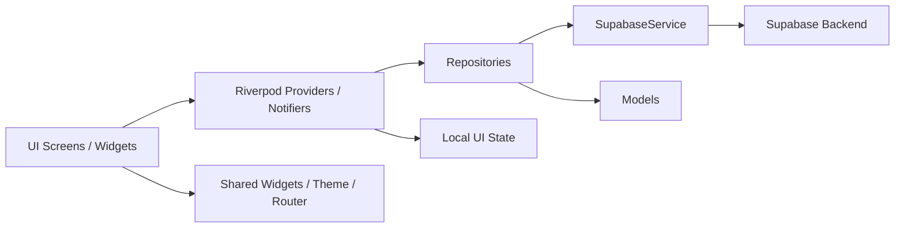
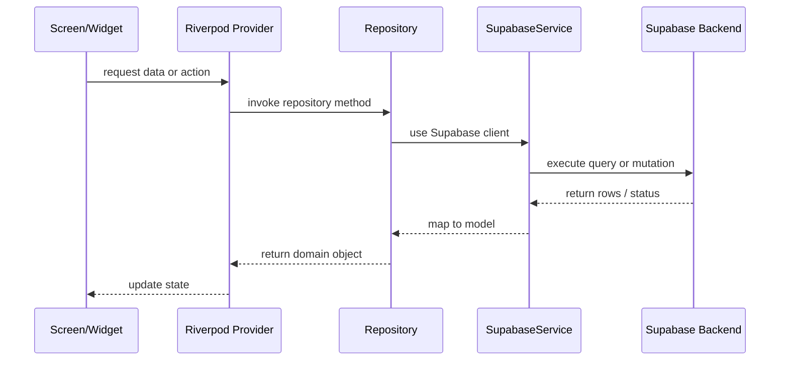
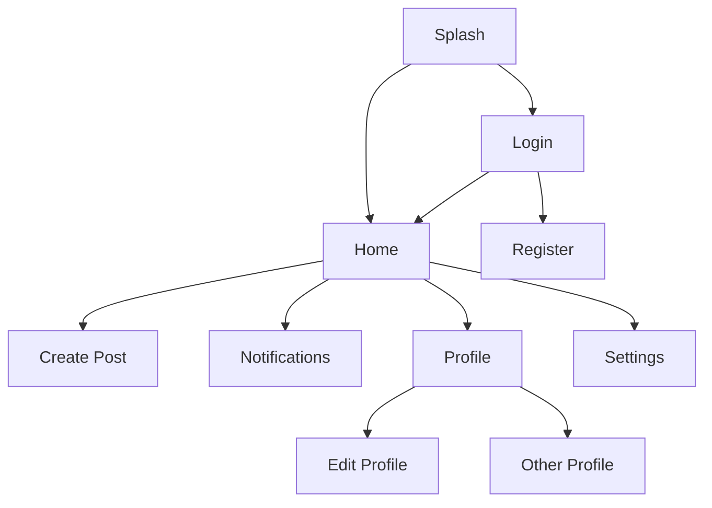

# Architectural Analysis of the Flutter Project

**Product:** Entangl  
**Docs index:** [../README.md](../README.md) · [../DOCUMENTATION.md](../DOCUMENTATION.md)  
**Related:** [ARCHITECTURE_AUDIT.md](ARCHITECTURE_AUDIT.md) · [../notifications/STATUS.md](../notifications/STATUS.md) · [../ux/UI_UX_AUDIT.md](../ux/UI_UX_AUDIT.md)

This document is a production-style architectural review of the current Flutter application based on the actual source code in the repository.

> **Path note:** Links to `lib/…` below are written as repo-root paths (`../../lib/…`) so they resolve from this file under `docs/architecture/`.

## 1. Executive Summary

The project uses a feature-first Flutter architecture with Riverpod for state management and a repository layer for backend access. The app is organized around social features such as authentication, feed, posting, comments, stories, notifications, profile, search, and settings.

At a high level:

- UI screens live under the feature folders.
- Business logic is pushed into Riverpod providers and notifiers.
- Data access is abstracted behind repositories.
- Supabase is the backend and is accessed through a small service wrapper.

This structure is appropriate for a modern mobile app because it keeps feature modules isolated while still allowing shared infrastructure to be reused.

## 2. High-Level Architecture

### Architectural pattern

The application follows a hybrid architecture that is closest to:

- Feature-first architecture
- Repository pattern
- Riverpod-based state management
- Clean separation between UI, domain/data, and infrastructure concerns

It is not a strict Clean Architecture implementation with use-cases/interfaces/domain entities, but it is structured in a way that is clearly maintainable and scalable for a product app.

### Why this architecture fits the project

The codebase shows a clear separation between:

- Presentation: screens and widgets
- State: providers and notifiers
- Data access: repositories and Supabase service
- Shared infrastructure: router, theme, utilities

This separation is visible in files such as:

- [lib/main.dart](../../lib/main.dart)
- [lib/core/router/app_router.dart](../../lib/core/router/app_router.dart)
- [lib/data/repositories/posts_repository.dart](../../lib/data/repositories/posts_repository.dart)
- [lib/features/feed/providers/feed_provider.dart](../../lib/features/feed/providers/feed_provider.dart)

### Logical architecture diagram

### Responsibilities by layer

- Presentation layer
  - Screens and widgets render the UI.
  - They consume providers and respond to state changes.
  - Examples: [lib/features/auth/screens/login_screen.dart](../../lib/features/auth/screens/login_screen.dart), [lib/features/feed/screens/home_screen.dart](../../lib/features/feed/screens/home_screen.dart)

- State layer
  - Riverpod providers own asynchronous operations and UI state.
  - Examples: [lib/features/auth/providers/auth_provider.dart](../../lib/features/auth/providers/auth_provider.dart), [lib/features/post/providers/create_post_provider.dart](../../lib/features/post/providers/create_post_provider.dart)

- Data layer
  - Repositories isolate Supabase operations from UI code.
  - Examples: [lib/data/repositories/users_repository.dart](../../lib/data/repositories/users_repository.dart), [lib/data/repositories/notifications_repository.dart](../../lib/data/repositories/notifications_repository.dart)

- Infrastructure layer
  - Routing, theme, app lifecycle, config, and shared utilities.
  - Examples: [lib/core/router/app_router.dart](../../lib/core/router/app_router.dart), [lib/core/theme/app_theme.dart](../../lib/core/theme/app_theme.dart), [lib/core/utils/app_lifecycle.dart](../../lib/core/utils/app_lifecycle.dart)

## 3. Project Structure Analysis

### Root-level purpose

- [android](android), [ios](ios), [linux](linux), [macos](macos), [windows](windows): native platform wrappers.
- [assets](assets): images, icons, mascots, and doodles used by the UI.
- [docs](docs): design and architecture documentation.
- [lib](lib): the Flutter application source code.
- [test](test): automated tests.

### Main source folders

- [lib/main.dart](../../lib/main.dart): application entrypoint and Supabase bootstrap.
- [lib/core](../../lib/core): shared infrastructure such as routing, theme, constants, and utils.
- [lib/data](../../lib/data): models, repositories, and backend service abstraction.
- [lib/features](../../lib/features): business features and their presentation/state/data layers.
- [lib/shared](../../lib/shared): reusable UI widgets and app-wide shared providers.

### Folder interaction model

The cleanest mental model is:

- Feature screens depend on feature providers.
- Feature providers depend on repositories.
- Repositories depend on the Supabase service wrapper.
- Shared widgets and theme are used by feature UIs.

### Which folders are infrastructure vs business logic vs presentation

- Infrastructure: [lib/core](../../lib/core)
- Business logic: [lib/features](../../lib/features), [lib/data/repositories](../../lib/data/repositories)
- Presentation: [lib/features/\*/screens](../../lib/features), [lib/shared/widgets](../../lib/shared/widgets)

### Which folders should not directly communicate

A healthy rule for this codebase is:

- Screens should not call Supabase directly.
- Providers should not contain raw database logic beyond orchestrating repository calls.
- Repositories should not contain widget or navigation logic.

## 4. Feature-by-Feature Breakdown

### Authentication

- Purpose: sign in, sign up, and sign out users.
- Entry points: [lib/features/auth/screens/login_screen.dart](../../lib/features/auth/screens/login_screen.dart), [lib/features/auth/screens/register_screen.dart](../../lib/features/auth/screens/register_screen.dart), [lib/features/auth/screens/splash_screen.dart](../../lib/features/auth/screens/splash_screen.dart)
- State: [lib/features/auth/providers/auth_provider.dart](../../lib/features/auth/providers/auth_provider.dart)
- Repository: [lib/data/repositories/auth_repository.dart](../../lib/data/repositories/auth_repository.dart)
- Backend: Supabase Auth
- Navigation: redirect logic lives in [lib/core/router/app_router.dart](../../lib/core/router/app_router.dart)

### Feed

- Purpose: display posts from the community and support reactions.
- Entry point: [lib/features/feed/screens/home_screen.dart](../../lib/features/feed/screens/home_screen.dart)
- Provider: [lib/features/feed/providers/feed_provider.dart](../../lib/features/feed/providers/feed_provider.dart)
- Reusable UI: [lib/shared/widgets/post_card.dart](../../lib/shared/widgets/post_card.dart)
- Data source: [lib/data/repositories/posts_repository.dart](../../lib/data/repositories/posts_repository.dart)
- Navigation: opens create post, profile, and search from the home UI.

### Create Post

- Purpose: create a post with optional image upload.
- Entry point: [lib/features/post/screens/create_post_screen.dart](../../lib/features/post/screens/create_post_screen.dart)
- Provider: [lib/features/post/providers/create_post_provider.dart](../../lib/features/post/providers/create_post_provider.dart)
- Reusable UI: [lib/features/post/widgets/create_post_form.dart](../../lib/features/post/widgets/create_post_form.dart)
- Repository: [lib/data/repositories/posts_repository.dart](../../lib/data/repositories/posts_repository.dart)
- Dependency: invalidates feed and profile providers after submission.

### Comments

- Purpose: view and add comments and replies on posts.
- Provider: [lib/features/comments/providers/comments_provider.dart](../../lib/features/comments/providers/comments_provider.dart)
- Repository: [lib/data/repositories/comments_repository.dart](../../lib/data/repositories/comments_repository.dart)
- UI: [lib/features/comments/widgets/comments_sheet.dart](../../lib/features/comments/widgets/comments_sheet.dart)
- Flow: comment input state is separate from the actual comments list state.

### Stories

- Purpose: show temporary stories and allow story creation and viewing.
- Provider: [lib/features/stories/providers/stories_provider.dart](../../lib/features/stories/providers/stories_provider.dart)
- Repository: [lib/data/repositories/stories_repository.dart](../../lib/data/repositories/stories_repository.dart)
- Screens/widgets: [lib/features/stories/screens/story_viewer_screen.dart](../../lib/features/stories/screens/story_viewer_screen.dart), [lib/features/stories/widgets/create_story_sheet.dart](../../lib/features/stories/widgets/create_story_sheet.dart)
- Data model: [lib/data/models/story_model.dart](../../lib/data/models/story_model.dart)

### Notifications

- Purpose: in-app activity inbox + optional **mobile FCM** push (web push skipped).
- Provider: [lib/features/notifications/providers/notifications_provider.dart](../../lib/features/notifications/providers/notifications_provider.dart)
- Push bootstrap: [lib/features/notifications/providers/push_bootstrap_provider.dart](../../lib/features/notifications/providers/push_bootstrap_provider.dart)
- Deep links: [lib/features/notifications/utils/notification_navigation.dart](../../lib/features/notifications/utils/notification_navigation.dart)
- Repository: [lib/data/repositories/notifications_repository.dart](../../lib/data/repositories/notifications_repository.dart)
- Tokens: [lib/data/repositories/device_tokens_repository.dart](../../lib/data/repositories/device_tokens_repository.dart)
- FCM service: [lib/data/services/notification_service.dart](../../lib/data/services/notification_service.dart)
- UI: [lib/features/notifications/screens/notifications_screen.dart](../../lib/features/notifications/screens/notifications_screen.dart)
- Backend: Postgres triggers → `notifications`; Edge Function `send-push` + `device_tokens` for FCM
- Status docs: [../notifications/STATUS.md](../notifications/STATUS.md), [../notifications/PENDING.md](../notifications/PENDING.md), [../notifications/PUSH.md](../notifications/PUSH.md)
- Docs index: [../README.md](../README.md)
- **Not yet:** Supabase Realtime channel for in-app live badge; RPC `get_unread_notification_count` in client

### Profile

- Purpose: show own or other profiles, stats, posts, and follow actions.
- Screen: [lib/features/profile/screens/profile_screen.dart](../../lib/features/profile/screens/profile_screen.dart)
- Provider: [lib/features/profile/providers/profile_provider.dart](../../lib/features/profile/providers/profile_provider.dart)
- Repositories: [lib/data/repositories/users_repository.dart](../../lib/data/repositories/users_repository.dart), [lib/data/repositories/posts_repository.dart](../../lib/data/repositories/posts_repository.dart)
- Reusable UI: [lib/features/profile/widgets/profile_header.dart](../../lib/features/profile/widgets/profile_header.dart), [lib/features/profile/widgets/follow_list.dart](../../lib/features/profile/widgets/follow_list.dart)

### Search

- Purpose: search users by name or username.
- Screen: [lib/features/search/screens/search_screen.dart](../../lib/features/search/screens/search_screen.dart)
- Provider: [lib/features/search/providers/search_provider.dart](../../lib/features/search/providers/search_provider.dart)
- Repository: [lib/data/repositories/users_repository.dart](../../lib/data/repositories/users_repository.dart)

### Settings

- Purpose: account and app preference UI.
- Screen: [lib/features/settings/screens/settings_screen.dart](../../lib/features/settings/screens/settings_screen.dart)
- State: [lib/features/settings/providers/settings_provider.dart](../../lib/features/settings/providers/settings_provider.dart)

## 5. Data Flow Analysis

### Login

1. User enters credentials in [lib/features/auth/screens/login_screen.dart](../../lib/features/auth/screens/login_screen.dart).
2. The screen calls the auth notifier.
3. The notifier invokes [lib/data/repositories/auth_repository.dart](../../lib/data/repositories/auth_repository.dart).
4. The repository calls Supabase Auth.
5. On success, the router redirect logic notices a session and sends the user to the home route.

### Registration

1. The register screen collects user details.
2. The notifier calls the repository to sign up.
3. The repository inserts profile-related metadata into Supabase Auth user data.
4. The router redirects to the home route after a valid session exists.

### Feed

1. The home screen watches [lib/features/feed/providers/feed_provider.dart](../../lib/features/feed/providers/feed_provider.dart).
2. The provider requests posts from the posts repository.
3. The repository queries the posts table with related profile, likes, dislikes, and comments data.
4. The provider maps rows into [lib/data/models/post_model.dart](../../lib/data/models/post_model.dart).
5. The UI re-renders and shows the feed.

### Create Post

1. The create post screen uses a local state notifier.
2. On submit, the notifier asks the repository to upload an optional image and insert a post row.
3. The repository uploads to storage and writes to the posts table.
4. The provider invalidates feed and profile caches.
5. The screen closes and the user returns to the previous screen.

### Comments

1. The comments sheet requests comments from the comments repository.
2. The provider stores comments in an async state object.
3. Adding a comment updates the provider state immediately and persists through the repository.
4. Replies are attached to the parent comment object.

### Stories

1. The story row pulls active stories from the stories provider.
2. The stories repository reads story rows plus view/like metadata.
3. The UI shows grouped stories for each user.
4. Viewing a story marks it as viewed through the repository.

### Notifications

1. The notifications screen watches the notifications provider.
2. The provider asks the repository for the current user’s notification list.
3. Marking read or removing a notification updates the provider state and persists to Supabase.

### Profile

1. The profile screen asks for profile stats and posts.
2. The provider fetches profile stats and user posts from the repositories.
3. Follow/unfollow actions update state optimistically and then sync with Supabase.
4. The profile UI updates immediately and refreshes on confirmation.

### Search

1. The search delegate collects the query string.
2. The search provider derives results from the query.
3. A repository call searches the profiles table using a case-insensitive match.
4. The UI lists matching users and navigates to the profile on tap.

## 6. State Management Analysis

### Approach used

The project uses Riverpod with a mix of:

- Provider for repositories and simple dependency injection
- AsyncNotifier for feature state such as feed, notifications, and auth
- Notifier for local form state such as create-post and edit-profile
- FutureProvider and FutureProvider.family for derived async data

### Where providers are created

- Auth: [lib/features/auth/providers/auth_provider.dart](../../lib/features/auth/providers/auth_provider.dart)
- Feed: [lib/features/feed/providers/feed_provider.dart](../../lib/features/feed/providers/feed_provider.dart)
- Create post: [lib/features/post/providers/create_post_provider.dart](../../lib/features/post/providers/create_post_provider.dart)
- Profile: [lib/features/profile/providers/profile_provider.dart](../../lib/features/profile/providers/profile_provider.dart)
- Notifications: [lib/features/notifications/providers/notifications_provider.dart](../../lib/features/notifications/providers/notifications_provider.dart)
- Search: [lib/features/search/providers/search_provider.dart](../../lib/features/search/providers/search_provider.dart)
- Stories: [lib/features/stories/providers/stories_provider.dart](../../lib/features/stories/providers/stories_provider.dart)

### State propagation model

The general flow is:

1. A screen watches a provider.
2. The provider reads a repository.
3. The repository fetches data from Supabase.
4. The provider exposes the result as state.
5. The UI rebuilds.

### Performance observations

- Optimistic UI updates are used in feed reactions and follow toggles, which improves perceived responsiveness.
- The feed provider uses pending sets to preserve user action state while the backend confirms changes.
- The profile and feed providers invalidate caches to keep data fresh.

### Improvement opportunities

- Use provider families more consistently to avoid repeated repository construction.
- Add dedicated error-state handling rather than relying on generic exception strings.
- Consider caching and pagination strategies for large feeds and notification lists.
- Reduce unnecessary rebuilds by using more focused providers and selectors.

## 7. Backend Integration

### Supabase initialization

The app initializes Supabase in [lib/main.dart](../../lib/main.dart) during startup. The configuration comes from [lib/core/secrets.dart](../../lib/core/secrets.dart).

### Authentication flow

Authentication is handled through Supabase Auth, wrapped by [lib/data/repositories/auth_repository.dart](../../lib/data/repositories/auth_repository.dart). The router performs redirects based on the current session.

### Database interactions

Repositories issue direct Supabase client calls to tables such as:

- profiles
- posts
- likes
- dislikes
- comments
- follows
- notifications
- stories
- story_views
- story_likes

### Storage usage

The repositories upload images and avatars to Supabase Storage for:

- post images
- profile avatars
- story media

### Request lifecycle diagram

## 8. Models

| Model             | Purpose                            | Used by                        | Notes                                                |
| ----------------- | ---------------------------------- | ------------------------------ | ---------------------------------------------------- |
| UserModel         | Represents a profile user          | profile, search, feed, stories | Used to render author and profile information        |
| PostModel         | Represents a social post           | feed, profile, comments        | Contains like/dislike/comment counts and author info |
| CommentModel      | Represents comments and replies    | comments feature               | Supports nested replies                              |
| NotificationModel | Represents activity notifications  | notifications feature          | Includes actor and post relationships                |
| ProfileStatsModel | Represents profile page statistics | profile feature                | Holds counts and follow status                       |
| StoryModel        | Represents a story item            | stories feature                | Includes media URL, type, and view/like state        |
| UserStories       | Groups stories by user             | stories feature                | Used for the story row UI                            |

## 9. Repository Layer

### AuthRepository

- Responsibility: authentication actions
- Methods: signUp, signIn, signOut
- Dependency: Supabase client

### PostsRepository

- Responsibility: create, read, update, and react to posts
- Methods: getFeedPosts, getUserPosts, createPost, deletePost, likePost, unlikePost, dislikePost, undislikePost
- Dependency: Supabase client and storage

### UsersRepository

- Responsibility: profile lookup, follow state, profile updates, user search
- Methods: getOwnProfile, getProfileStats, updateProfile, followUser, unfollowUser, getFollowers, getFollowing, searchUsers

### NotificationsRepository

- Responsibility: read notifications and update read state
- Methods: getNotifications, getUnreadCount, markAsRead, markAllAsRead, deleteNotification

### CommentsRepository

- Responsibility: fetch and manage comments/replies
- Methods: getComments, addComment, deleteComment

### StoriesRepository

- Responsibility: story CRUD and story interaction tracking
- Methods: getActiveStories, createStory, markViewed, likeStory, unlikeStory, deleteStory, getStoryViewers

### Why the repository pattern is used

The repository layer centralizes all backend access and prevents feature code from becoming tightly coupled to Supabase APIs. It makes the app easier to test and easier to replace if the backend changes later.

## 10. Navigation

The navigation system is implemented with GoRouter in [lib/core/router/app_router.dart](../../lib/core/router/app_router.dart).

### Route structure

- /: splash
- /login: login screen
- /register: registration screen
- /home: feed
- /create-post: create post
- /notifications: notifications
- /profile: own profile
- /profile/:userId: other user profile
- /profile/edit: edit profile
- /settings: settings

### Navigation graph

### Auth guard behavior

The router redirects unauthenticated users away from protected routes and sends logged-in users away from the login route.

## 11. UI Architecture

The UI is built with a composition-oriented widget approach.

### Reusable widgets

- [lib/shared/widgets/post_card.dart](../../lib/shared/widgets/post_card.dart): renders a social post card
- [lib/shared/widgets/avatar_widget.dart](../../lib/shared/widgets/avatar_widget.dart): consistent avatar rendering
- [lib/shared/widgets/connect_nav_bar.dart](../../lib/shared/widgets/connect_nav_bar.dart): bottom navigation bar
- [lib/shared/widgets/gradient_button.dart](../../lib/shared/widgets/gradient_button.dart): shared action button styling
- [lib/shared/widgets/gradient_text.dart](../../lib/shared/widgets/gradient_text.dart): reused text styling

### Theme system

The app uses a custom theme layer via [lib/core/theme/app_theme.dart](../../lib/core/theme/app_theme.dart), [lib/core/theme/app_colors.dart](../../lib/core/theme/app_colors.dart), and [lib/core/theme/app_text_styles.dart](../../lib/core/theme/app_text_styles.dart).

### UI composition pattern

Feature screens are composed from smaller widgets rather than embedding all UI logic in one file. This is a strong maintainability choice and makes the app easier to evolve.

## 12. Dependency Analysis

### External packages

From [pubspec.yaml](pubspec.yaml):

- supabase_flutter: backend access and auth
- flutter_riverpod: state management
- go_router: navigation
- image_picker: media picking
- video_player: video support
- cached_network_image: image caching
- shared_preferences: local persistence
- flutter_secure_storage: declared (session persistence primarily via Supabase)
- shimmer: skeleton loading states
- flutter_animate: animation
- google_fonts: typography
- firebase_core / firebase_messaging / flutter_local_notifications: **mobile FCM push**

### Why these dependencies matter

The app is built as a modern Flutter product app rather than a simple CRUD demo. The dependency set suggests a real-world mobile architecture with authentication, media uploads, async UI states, and styling polish.

## 13. Performance Review

### Strengths

- Optimistic UI updates improve the feeling of responsiveness.
- The feed and profile screens use async providers and loading states.
- Repositories centralize network work and make state updates predictable.

### Potential bottlenecks

- Feed loading and provider invalidation can trigger larger refreshes than necessary.
- The app relies on frequent remote requests for profile stats and notifications without obvious long-lived caching beyond Riverpod providers.
- Large lists could benefit from more targeted pagination and virtualization patterns.

### Optimization suggestions

- Introduce more granular provider invalidation where possible.
- Add caching for frequently requested profile and notification data.
- Consider using paged lists and a dedicated pagination controller for large feeds.
- Refactor some UI to reduce repeated rebuilds by using narrower providers.

## 14. Security Review

### What is currently good

- The app does not embed backend logic inside screens.
- Authentication uses Supabase Auth.
- The router uses session presence to restrict access.

### Risks and concerns

- The configuration file [lib/core/secrets.dart](../../lib/core/secrets.dart) contains runtime values and should be treated as sensitive infrastructure.
- The app appears to rely on the anonymous Supabase key for client-side access; this is common for public apps, but row-level security and database policies must be enforced on the backend.
- The current repository methods assume the current user is authenticated and use direct client calls without an explicit domain-layer permission policy.

### Recommendations

- Enforce strict Supabase Row Level Security policies.
- Avoid exposing privileged logic to the client.
- Move sensitive configuration to a secure environment strategy during deployment.
- Add explicit auth and permission checks around profile updates and private actions.

## 15. Code Quality Review

### Strengths

- Clear feature-based organization.
- Good separation between screens, providers, and repositories.
- Reusable shared widgets.
- Consistent use of Riverpod for state.

### Weaknesses

- Some files mix UI and state concerns, especially in larger screens.
- The app uses a fairly broad feature-first structure, but there is still room to further isolate screen-specific logic into dedicated view-model-like notifiers.
- Some repositories and providers could be made more uniform in naming and error handling patterns.

### Quality score

- Overall code quality: 8/10
- Maintainability: 8/10
- Scalability: 7.5/10
- Readability: 8/10
- Security: 6.5/10

## 16. Design Patterns Used

- Repository Pattern: repositories wrap data access.
- Provider/Dependency Injection: Riverpod providers create and expose dependencies.
- Observer Pattern: providers notify listening widgets when state changes.
- Optimistic UI Pattern: feed likes/dislikes and follow actions update immediately.
- Feature-first organization: each feature has its own screens, providers, and widgets.

## 17. Improvement Opportunities

### Highest impact improvements

1. Add stronger error handling and typed results across repositories.
2. Introduce more explicit domain abstractions for business rules.
3. Improve caching and pagination for feed, notifications, and profile data.
4. Strengthen backend authorization and storage policies.
5. Add integration and widget test coverage for the major flows.

### Medium impact improvements

- Split bigger screens into more focused subwidgets.
- Standardize provider naming and state object patterns.
- Reduce duplicated UI logic across features.

## 18. Final Summary

This project is structured as a solid feature-first Flutter application with Riverpod and Supabase at its core. The architecture is already good enough for a real product app, especially because it keeps UI, state, and backend concerns separated in a relatively clean way.

The application’s strengths are:

- clear module boundaries
- reusable UI components
- usable repository abstraction
- strong use of Riverpod for asynchronous state
- a consistent social app flow across auth, feed, profile, and activity features

The biggest opportunities are:

- tighter error modeling
- stronger security enforcement at the backend
- more advanced caching and pagination
- better test coverage and more consistent state patterns

Overall, the architecture is well-structured for continued growth and can be evolved into a more formal domain-driven or clean architecture shape if the product expands significantly.
